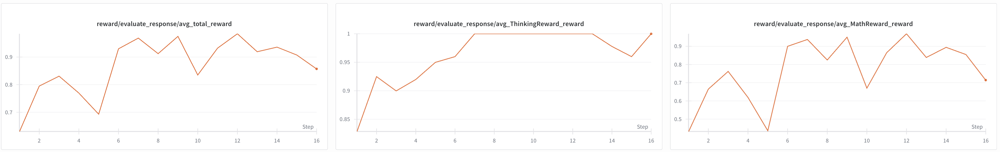

Last updated: 2025-12-05

# GRPO on GSM8K

Training GRPO (Grouped Relative Policy Optimization) on GSM8K grade school math word problems.

## Dataset

GSM8K consists of grade school math word problems that require multi-step arithmetic reasoning. Models generate solutions with chain-of-thought reasoning and provide final answers in `\boxed{}` format.

**Example Input:**
```
<|begin_of_text|><|start_header_id|>system<|end_header_id|>

Cutting Knowledge Date: December 2023
Today Date: 26 Jul 2024

Put all your scratchpad work between <think> and </think> tags.
            Your final answer should be between <answer> and </answer> tags otherwise it will not be scored.<|eot_id|><|start_header_id|>user<|end_header_id|>

Lucille is painting her room. Two of her walls are 3 meters wide and 2 meters tall. The third wall is 5 meters wide and 2 meters tall. The final wall is 4 meters wide and 2 meters tall. If each can of paint covers 2 square meters, how many cans of paint does Lucille need?<|eot_id|><|start_header_id|>assistant<|end_header_id|>
```

**Example Output:**
```
<think>
First, let's calculate the area of each wall:

- Two walls of 3 meters x 2 meters = 3 x 2 = 6 square meters per wall. Since there are two of these, 6 * 2 = 12 square meters.
- The third wall is 5 meters x 2 meters = 10 square meters.
- The final wall is 4 meters x 2 meters = 8 square meters.
Total wall area = 12 + 10 + 8 = 30 square meters.

Since each can covers 2 square meters, we need to divide the total wall area by the area one can covers: 30 / 2 = 15.

</think>

<answer>15</answer>
```

## Quick Start

**Llama 3.1 8B** (recommended for learning, requires 5 GPUs as is, not optimized):
```bash
python -m apps.grpo.main --config apps/grpo/llama3_8b.yaml
```

**Qwen3 1.7B** (NOTE: Qwen3 is already saturated on GSM8K, so rewards will **not** increase. Requires 3 GPUs, not optimized):
```bash
python -m apps.grpo.main --config apps/grpo/qwen3_1_7b.yaml
```

## Expected Results

For **Llama 3.1 8B**, training rewards should rise above 0.8 within the first few steps as the model learns the task.



## Configurations

- `llama3_8b.yaml` - Meta Llama 3.1 8B Instruct
- `qwen3_1_7b.yaml` - Qwen3 1.7B
- `qwen3_8b.yaml` - Qwen3 8B
- `qwen3_32b.yaml` - Qwen3 32B
